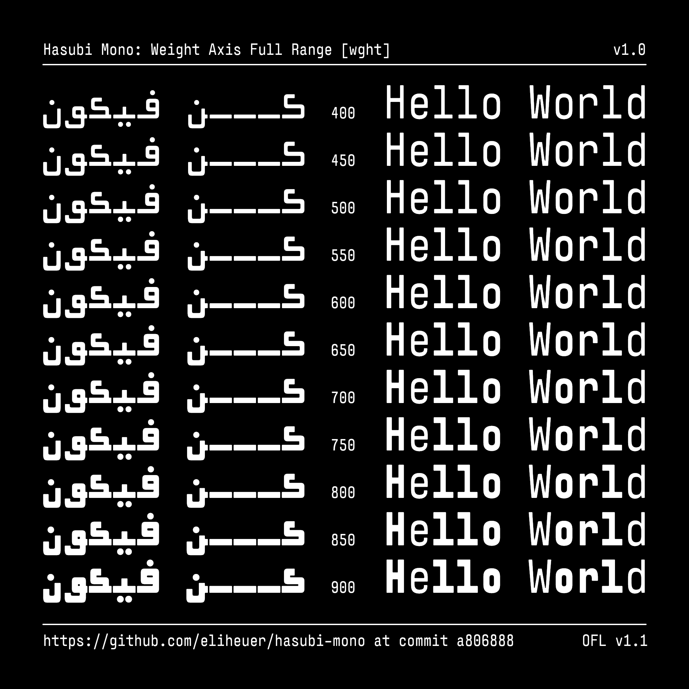
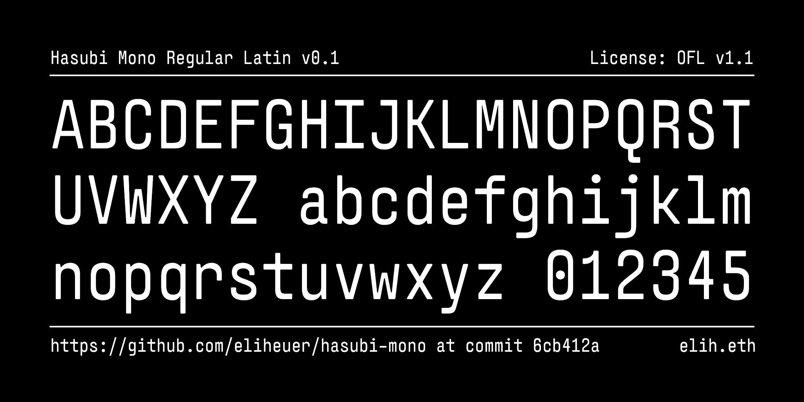

# Hasubi Mono (حاسوبي مونو)

[![][Fontbakery]](https://eliheuer.github.io/hasubi-mono/fontbakery/fontbakery-report.html)
[![][Universal]](https://eliheuer.github.io/hasubi-mono/fontbakery/fontbakery-report.html)
[![][GF Profile]](https://eliheuer.github.io/hasubi-mono/fontbakery/fontbakery-report.html)
[![][Outline Correctness]](https://eliheuer.github.io/hasubi-mono/fontbakery/fontbakery-report.html)
[![][Shaping]](https://eliheuer.github.io/hasubi-mono/fontbakery/fontbakery-report.html)

[Fontbakery]: https://img.shields.io/endpoint?url=https%3A%2F%2Fraw.githubusercontent.com%2Feliheuer%2Fhasubi-mono%2Fgh-pages%2Fbadges%2Foverall.json
[GF Profile]: https://img.shields.io/endpoint?url=https%3A%2F%2Fraw.githubusercontent.com%2Feliheuer%2Fhasubi-mono%2Fgh-pages%2Fbadges%2FGoogleFonts.json
[Outline Correctness]: https://img.shields.io/endpoint?url=https%3A%2F%2Fraw.githubusercontent.com%2Feliheuer%2Fhasubi-mono%2Fgh-pages%2Fbadges%2FOutlineCorrectnessChecks.json
[Shaping]: https://img.shields.io/endpoint?url=https%3A%2F%2Fraw.githubusercontent.com%2Feliheuer%2Fhasubi-mono%2Fgh-pages%2Fbadges%2FShapingChecks.json
[Universal]: https://img.shields.io/endpoint?url=https%3A%2F%2Fraw.githubusercontent.com%2Feliheuer%2Fhasubi-mono%2Fgh-pages%2Fbadges%2FUniversal.json

Hasubi Mono (حاسوبي مونو) is an Arabic, Hebrew, and Latin condensed monospace typeface designed for use in text editors and terminals.

## About

This typeface is designed and maintained by Eli Heuer, send ETH tips to eliheuer.eth if you enjoy this font and want to suport my work.

## Building

Fonts are built automatically by GitHub Actions - take a look in the "Actions" tab for the latest build.

If you want to build fonts manually on your own computer:

* `make build` will produce font files.
* `make test` will run [FontBakery](https://github.com/googlefonts/fontbakery)'s quality assurance tests.
* `make proof` will generate HTML proof files.

The proof files and QA tests are also available automatically via GitHub Actions - look at https://eliheuer.github.io/hasubi-mono.

## License

This Font Software is licensed under the SIL Open Font License, Version 1.1.
This license is available with a FAQ at
https://scripts.sil.org/OFL

## Repository Layout

This font repository structure is inspired by [Unified Font Repository v0.3](https://github.com/unified-font-repository/Unified-Font-Repository), modified for the Google Fonts workflow.

## Changelog

**01 May 2022. Version 0.001**
- Set up a basic variable font with weight range 400-900
- Added new DrawBot images

