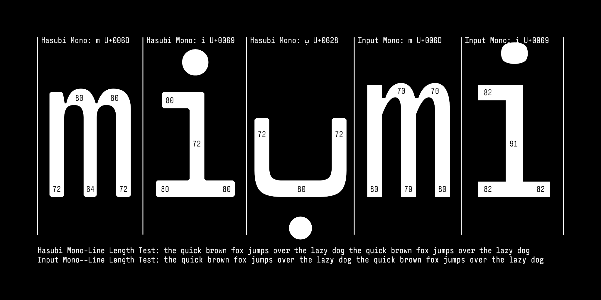

# Hasubi Mono (حاسوبي مونو)

[![][Fontbakery]](https://eliheuer.github.io/hasubi-mono/fontbakery/fontbakery-report.html)
[![][Universal]](https://eliheuer.github.io/hasubi-mono/fontbakery/fontbakery-report.html)
[![][GF Profile]](https://eliheuer.github.io/hasubi-mono/fontbakery/fontbakery-report.html)
[![][Outline Correctness]](https://eliheuer.github.io/hasubi-mono/fontbakery/fontbakery-report.html)
[![][Shaping]](https://eliheuer.github.io/hasubi-mono/fontbakery/fontbakery-report.html)

[Fontbakery]: https://img.shields.io/endpoint?url=https%3A%2F%2Fraw.githubusercontent.com%2Feliheuer%2Fhasubi-mono%2Fgh-pages%2Fbadges%2Foverall.json
[GF Profile]: https://img.shields.io/endpoint?url=https%3A%2F%2Fraw.githubusercontent.com%2Feliheuer%2Fhasubi-mono%2Fgh-pages%2Fbadges%2FGoogleFonts.json
[Outline Correctness]: https://img.shields.io/endpoint?url=https%3A%2F%2Fraw.githubusercontent.com%2Feliheuer%2Fhasubi-mono%2Fgh-pages%2Fbadges%2FOutlineCorrectnessChecks.json
[Shaping]: https://img.shields.io/endpoint?url=https%3A%2F%2Fraw.githubusercontent.com%2Feliheuer%2Fhasubi-mono%2Fgh-pages%2Fbadges%2FShapingChecks.json
[Universal]: https://img.shields.io/endpoint?url=https%3A%2F%2Fraw.githubusercontent.com%2Feliheuer%2Fhasubi-mono%2Fgh-pages%2Fbadges%2FUniversal.json

## 🚧 WARNING! 🚧 This font is under construction!

### This is an alpha quality pre-1.0 typeface, not ready for use and currently under development.

Hasubi Mono (حاسوبي مونو) is a condensed horizontal contrast monospace typeface designed by Eli Heuer. Arabic, Hebrew, and Latin scripts are included in the font, and all scripts are designed to share the same horizontal contrast as the Arabic. Hasubi is a transliteration of “حاسوبي (my computer).”

## Design Notes
Hasubi Mono has a few unique features that need some explanation such as horizontal contrast and the GAPS axis.

### Horizontal Contrast
Hasubi mono was designed specifically for people who work with Arabic and Hebew in text editors and terminals. Because the whole typeface shares the horizontal contrast from the Arabic, the font is very condensed at it's default width. See the below image comparing Hasubi Mono with Input Mono Compressed.

### Gaps Axis
Note that the Arabic glyphs in this font have gaps, in the variable font version of this font there will be a GAPS custom axis that interpolates between open and closed gaps. This is inspired by printing in older [books](https://archive.org/details/materialsforstud0000brow) make with metal type.

## About

🚧 WARNING! 🚧 This font is Under Construction!

## Building

Fonts are built automatically by GitHub Actions - take a look in the "Actions" tab for the latest build.

If you want to build fonts manually on your own computer:

* `make build` will produce font files.
* `make test` will run [FontBakery](https://github.com/googlefonts/fontbakery)'s quality assurance tests.
* `make proof` will generate HTML proof files.

The proof files and QA tests are also available automatically via GitHub Actions - look at https://eliheuer.github.io/hasubi-mono.

## License

This Font Software is licensed under the SIL Open Font License, Version 1.1.
This license is available with a FAQ at
https://scripts.sil.org/OFL

## Repository Layout

This font repository structure is inspired by [Unified Font Repository v0.3](https://github.com/unified-font-repository/Unified-Font-Repository), modified for the Google Fonts workflow.

## Changelog

**10 Jan 2023. Version 0.001**
- Added new images to the main README
- Almost done with Arabic drawings

**01 May 2022. Version 0.001**
- Set up a basic variable font with weight range 400-900
- Added new DrawBot images

