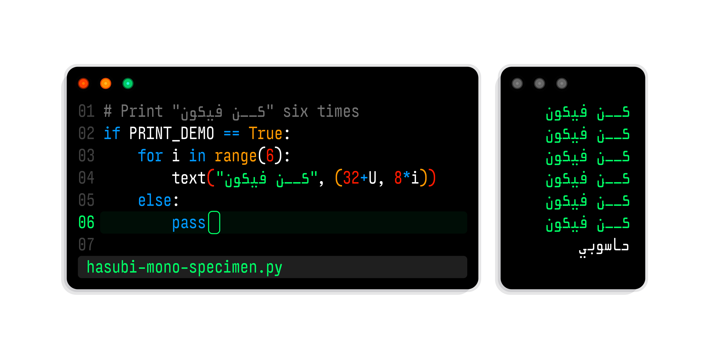
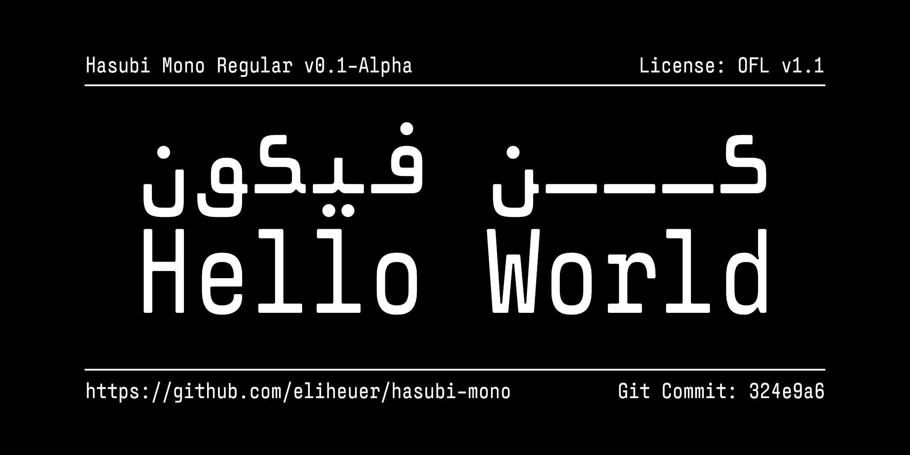
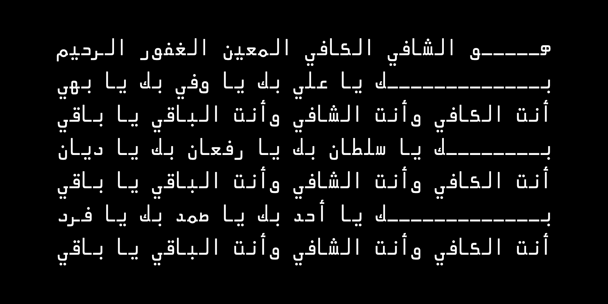
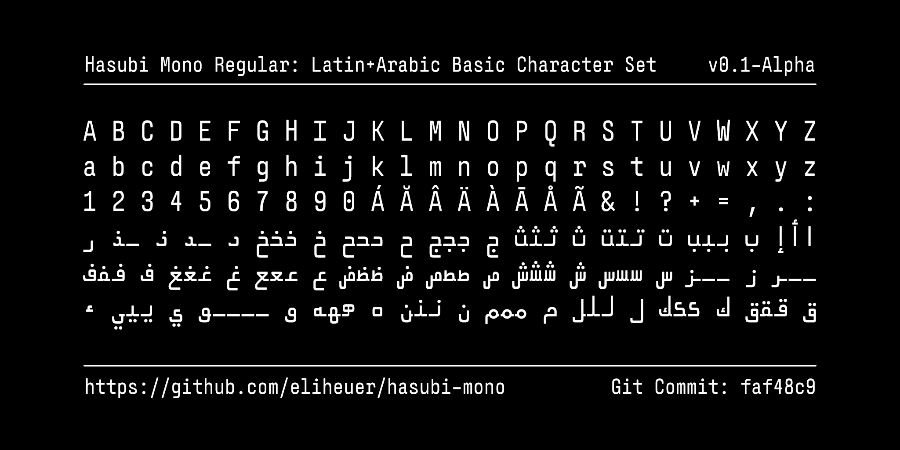

# Hasubi Mono (حاسوبي مونو)

[![][Fontbakery]](https://eliheuer.github.io/hasubi-mono/fontbakery/fontbakery-report.html)
[![][Universal]](https://eliheuer.github.io/hasubi-mono/fontbakery/fontbakery-report.html)
[![][GF Profile]](https://eliheuer.github.io/hasubi-mono/fontbakery/fontbakery-report.html)
[![][Outline Correctness]](https://eliheuer.github.io/hasubi-mono/fontbakery/fontbakery-report.html)
[![][Shaping]](https://eliheuer.github.io/hasubi-mono/fontbakery/fontbakery-report.html)

[Fontbakery]: https://img.shields.io/endpoint?url=https%3A%2F%2Fraw.githubusercontent.com%2Feliheuer%2Fhasubi-mono%2Fgh-pages%2Fbadges%2Foverall.json
[GF Profile]: https://img.shields.io/endpoint?url=https%3A%2F%2Fraw.githubusercontent.com%2Feliheuer%2Fhasubi-mono%2Fgh-pages%2Fbadges%2FGoogleFonts.json
[Outline Correctness]: https://img.shields.io/endpoint?url=https%3A%2F%2Fraw.githubusercontent.com%2Feliheuer%2Fhasubi-mono%2Fgh-pages%2Fbadges%2FOutlineCorrectnessChecks.json
[Shaping]: https://img.shields.io/endpoint?url=https%3A%2F%2Fraw.githubusercontent.com%2Feliheuer%2Fhasubi-mono%2Fgh-pages%2Fbadges%2FShapingChecks.json
[Universal]: https://img.shields.io/endpoint?url=https%3A%2F%2Fraw.githubusercontent.com%2Feliheuer%2Fhasubi-mono%2Fgh-pages%2Fbadges%2FUniversal.json

## 🚧 WARNING! 🚧 This font is under construction!

## ⚠️ This is an alpha quality pre-1.0 typeface, not ready for use and currently under development. ⚠️

Hasubi Mono (حاسوبي مونو) is an Arabic, Hebrew, and Latin condensed horizontal-contrast monospace typeface designed by Eli Heuer. Hasubi is a transliteration of “حاسوبي (my computer).”

A PDF print specimen in avaiable [here](documentation/drawbot/hasubi-mono-print-proof.pdf).

# Design Notes
Hasubi Mono has a few unique features that need some explanation, such as horizontal contrast and the GAPS axis.

## Horizontal Contrast
Hasubi mono was designed specifically for people who work with Arabic and Hebrew in text editors and terminals. Because the whole typeface shares a horizontal-contrast based drawing style that originates from the Arabic, the font is extremly condensed allowing a terminal user to make better use of screen space, or a designer to fit more text into a small space. See the below image comparing Hasubi Mono with Input Mono Compressed as an example. Note that Input Mono Compressed is one of the narrowest monospace fonts avaiable today, so the fact that Hasubi Mono is slightly more narrow while also including the Arabic alphabet should be somewhat impressive once the design problems around fonts like this are fully understood.

## Gaps Axis
Note that the Arabic glyphs in this font have gaps, in the variable font version of this typeface there will be a GAPS custom axis that interpolates between open and closed gaps. This style is inspired by the look of Arabic printing in older books printed with metal type. Specifically the book [Materials for the Study of the Bábí Religion](https://archive.org/details/materialsforstud0000brow) published in 1918 by Cambridge University Press, which the designer of this typeface read while learning Arabic and noticed that the gaps were helpful for a beginner Arabic reader. See a photo example below:

# About

🚧 WARNING! 🚧 This section is Under Construction!

# Building

Fonts are built automatically by GitHub Actions - take a look in the "Actions" tab for the latest build.

If you want to build fonts manually on your own computer:

* `make build` will produce font files.
* `make test` will run [FontBakery](https://github.com/googlefonts/fontbakery)'s quality assurance tests.
* `make proof` will generate HTML proof files.

The proof files and QA tests are also available automatically via GitHub Actions - look at https://eliheuer.github.io/hasubi-mono.

# License

This Font Software is licensed under the SIL Open Font License, Version 1.1.
This license is available with a FAQ at
https://scripts.sil.org/OFL

# Repository Layout

This font repository structure is inspired by [Unified Font Repository v0.3](https://github.com/unified-font-repository/Unified-Font-Repository), modified for the Google Fonts workflow.

# Changelog

**10 Jan 2023. Version 0.001**
- Added new images to the main README
- Almost done with Arabic drawings

**01 May 2022. Version 0.001**
- Set up a basic variable font with weight range 400-900
- Added new DrawBot images

